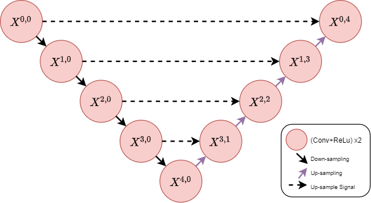
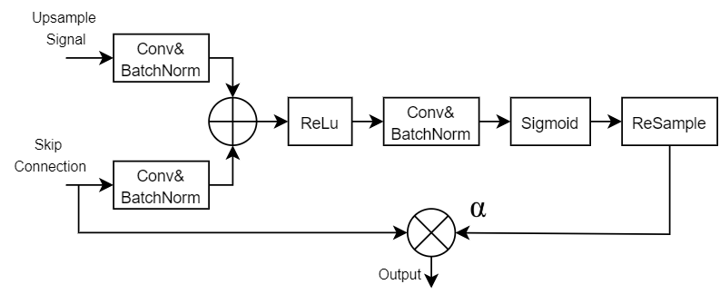
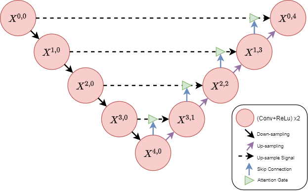
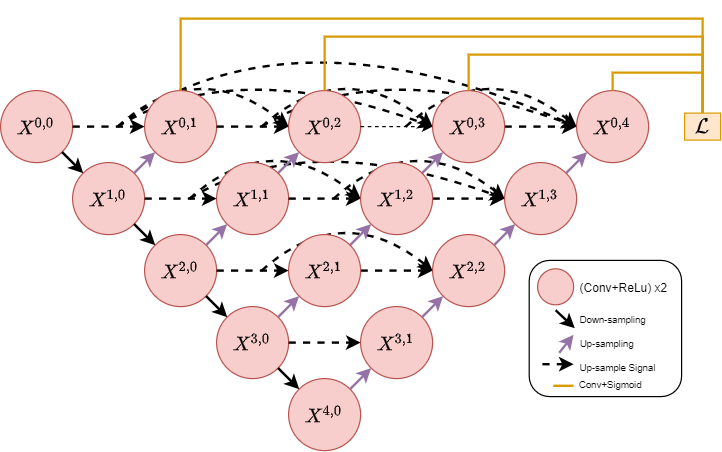
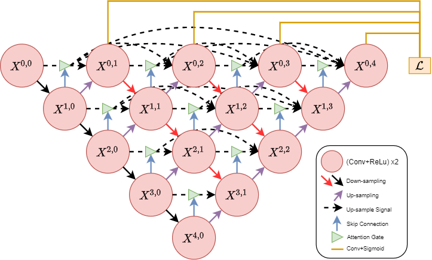

## U-Net

Title: U-Net: Convolutional Networks for Biomedical Image Segmentation.

Authors: Olaf Ronneberger, Philipp Fischer, and Thomas Brox.

The architecture of U-Net: 

## Attention U-Net

Title: Attention U-Net: Learning Where to Look for the Pancreas.

Authors: Ozan Oktay, Jo Schlemper, Loic Le Folgoc, Matthew Lee, Mattias Heinrich, Kazunari Misawa, Kensaku Mori, Steven McDonagh, Nils Y Hammerla, Bernhard Kainz, Ben Glocker, Daniel Rueckert.

The architecture of Attention Gate: 

The architecture of Attention U-Net: 

## U-Net++

Title: UNet++: Redesigning Skip Connections to Exploit Multiscale Features in Image Segmentation.

Authors: Zongwei Zhou, Md Mahfuzur Rahman Siddiquee, Nima Tajbakhsh, Jianming Liang.

The architecture of U-Net++: 

## Attention U-Net++

Title: Attention Unet++: A Nested Attention-Aware U-Net for Liver CT Image Segmentation.

Authors: Chen Li, Yusong Tan, Wei Chen, Xin Luo, Yuanming Gao, Xiaogang Jia, Zhiying Wang.

The architecture of Attention U-Net++: 

